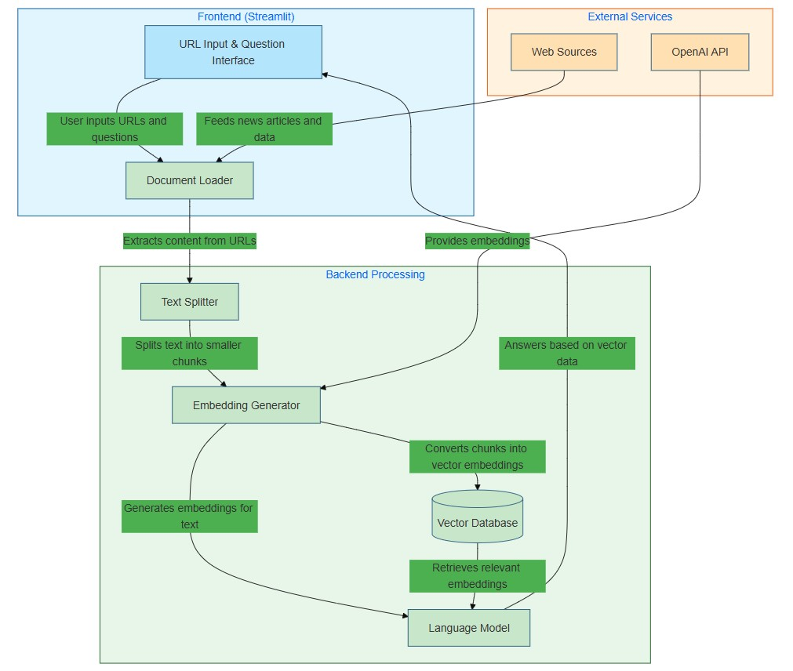
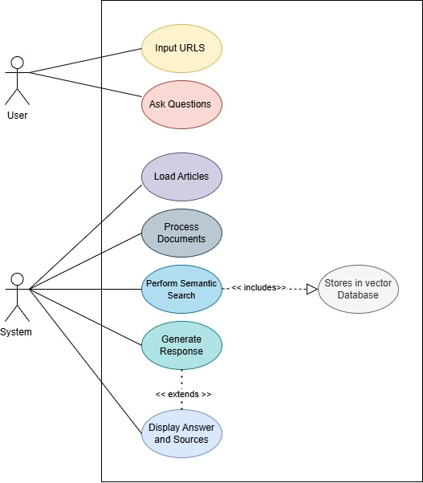
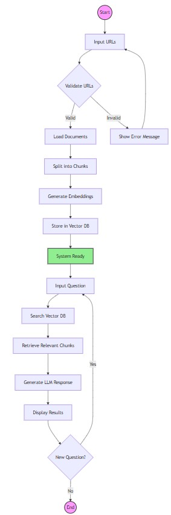
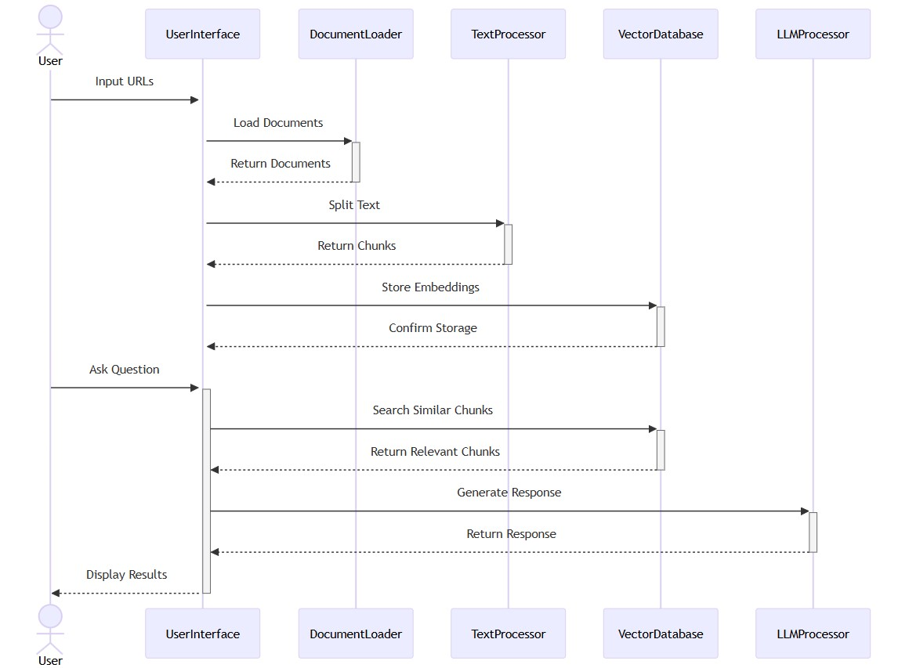
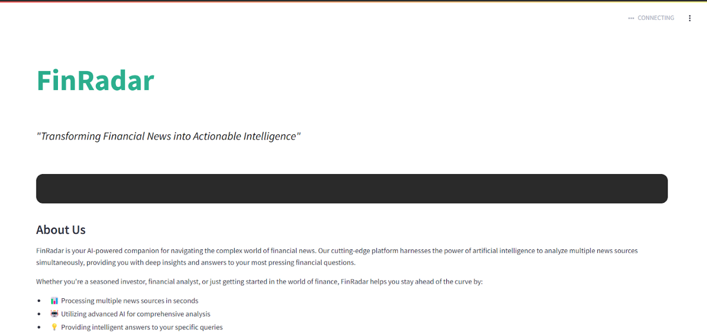
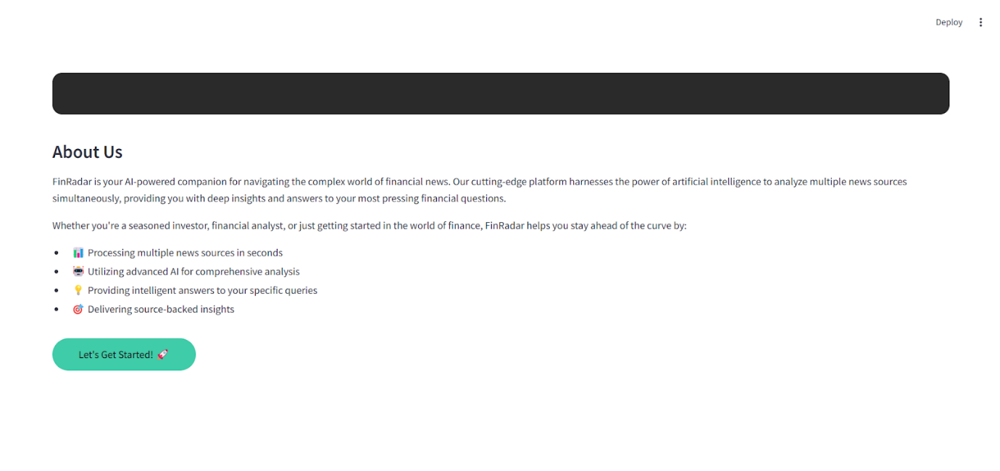
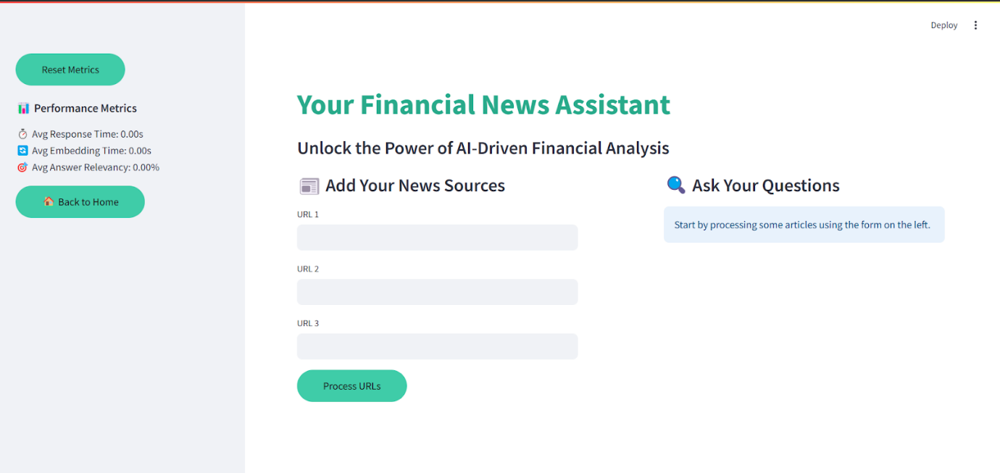
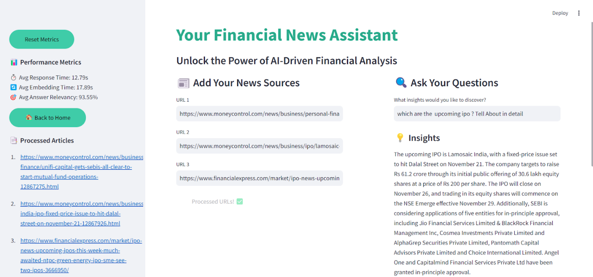
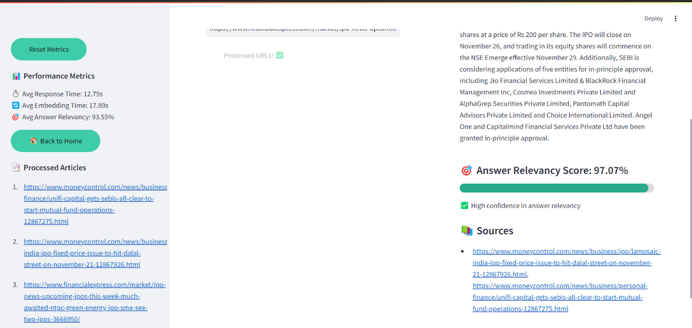

FinRadar: AI-Powered Financial News Analysis Tool 📈🤖

Overview
FinRadar is an innovative AI-driven platform that transforms financial news research by leveraging cutting-edge natural language processing and machine learning technologies. Designed to simplify and accelerate equity research, this tool empowers analysts, investors, and financial professionals to extract deep insights from multiple news sources instantly. 

🌟 Key Features
• Multi-Source Analysis: Process multiple news articles simultaneously
• AI-Powered Insights: Utilize advanced language models for comprehensive research
• Semantic Search: Find relevant information beyond simple keyword matching
• Performance Metrics: Real-time tracking of analysis efficiency
• User-Friendly Interface: Intuitive Streamlit-based web application 

🚀 Technical Architecture

Core Technologies
• Language Model: OpenAI GPT-3.5
• Embedding: OpenAI Embeddings
• Vector Database: FAISS
• Web Framework: Streamlit
• Libraries: LangChain, scikit-learn

Design Diagrams

High Level Design: System Architecture Diagram

Low Level Design: 
Use Case Diagram
    

Class Diagram

Activity Diagram

Sequence Diagram

Modules
1. Document Loading
• Supports multiple URL inputs
• Uses UnstructuredURLLoader for robust web scraping

2. Text Processing
• Recursive text splitting
• Intelligent chunk management

3. Vector Embedding
• Convert text to high-dimensional vectors
• Enable semantic search capabilities

4. AI-Powered Querying
• Generate contextually relevant answers
• Provide source-backed insights

🔍 Performance Evaluation
Key Metrics
• Response Time: Measure of query processing speed
• Embedding Time: Time taken to convert text to vectors
• Answer Relevancy: Semantic similarity of generated answers

Performance Dashboard
• Real-time tracking of analysis metrics
• Confidence scoring for generated insights
• Visual representation of answer relevancy

🌐 How It Works
1.	Input news article URLs
2.	Process and embed articles
3.	Ask specific questions about the content
4.	Receive AI-generated insights with source references

Output

